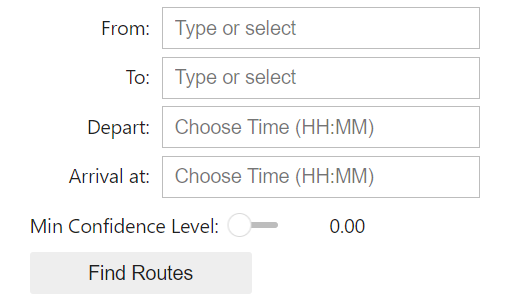
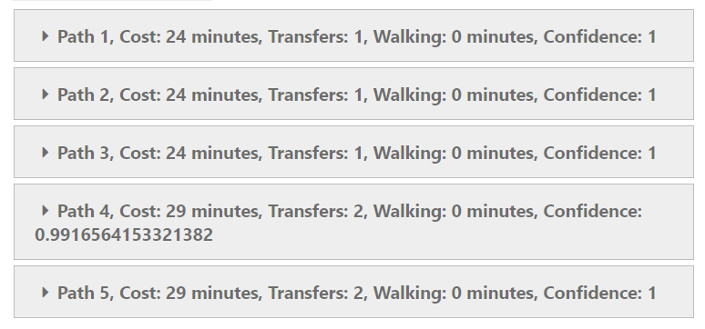

# Robust Journey Planning
**Summary:** This is a robust journey planner for public transport that works across different regions of Switzerland. A user can simply select arrival & departure stops, time of departure, preferred time of arrival, and a minimal level of confidence at which the user wants a journey to succeed. After that, the model will crunch a large amount of data and predict a set of routes for a user to choose from.

## Team members

- Siyuan Cheng, siyuan.cheng@epfl.ch
- Ioannis Bantzis, ioannis.bantzis@epfl.ch
- Aidas Venckunas, aidas.venckunas@epfl.ch
- Xinyi Ding, xinyi.ding@epfl.ch
- Jingbang Liu, jingbang.liu@epfl.ch
- Victoria Catherine Arduini, victoria.arduini@epfl.ch

## Quickstart
```shell
git clone git@dslabgit.datascience.ch:group-zz/final-project.git
cd final-project
pip install -r requirements.txt
```
## Project Organization

```shell
.
├── data
│   ├── sbb_real_stop_times.parquet
│   ├── sbb_timetable_stop_times.parquet
│   ├── stops.csv
│   └── stop_to_stop.csv
├── img
│   ├── google_censuy.png
│   ├── google_epfl.png
│   └── google_gare.png
├── sanity_test
│   ├── graph_test.py
│   └── path_test.py
├── src
│   ├── delay_model.py
│   ├── route_planning.py
│   ├── transport_network.py
│   └── util.py
├── README.md
├── requirements.txt
├── data_generation.py
├── validation-delay.ipynb
├── validation.ipynb
└── vizsualization.ipynb

```

## How-to
### Generating the Dataset
Settle the dataset by executing the file `./data_generation.py`. Select the area by changing the `object_id` at the top of the file.
```shell
python data_generation.py
```
**Note:** The current `./data` folder contains the dataset generated by setting `object_id = 1` (Lausanne area), please wait until the file finishes running to refresh the dataset whenever you change this parameter.

### Running the Interactive Planner
1. Open `./visualization.ipynb` and run all code cells. An interface with an input form will appear.

**Note:** For the stops and times, please type from the keyboard and select the suggested option, as using the dropdown alone may not display fully.




2. Select your preferred inputs, click on `Find Routes` and wait until the routes pop up.

**Note:** The display on the map might be corrupted due to incomplete stop information in the dataset. Please refer to the printed path details for complete information.



Select a path you like the most and enjoy your trip.

## Implementation details
In this section we cover the implementation details as well as our rationale for the choices we made when building the models.

### Datasets
The following datasets are created in `data_generation.py`:
- `sbb_real_stop_times.parquet`: the SBB istdaten dataset that is filtered to only contain entries from the last week of January. Only one week of data was used in order to simplify model building and execution. One can extend the dates to achieve more accurate historical statistics.
- `sbb_timetable_stop_times.parquet`: a timetable which contains all planned arrival and departure times for different trips in a stop. Additional columns were included to indicate weekdays for which the timetable entry holds. 
- `stops.csv`: all stop names in the selected region.
- `stop_to_stop.csv`: pairs of stops that are within 500m of each other.

### Routing algorithm

#### Building a transport network
The TransportNetwork class constructs a transport network graph from provided timetable, stop-to-stop distances, and stops data. Here’s a structured explanation of how the class operates:

**Column Name Processing:** `process_column_names` standardizes the column names in all three DataFrames.

**Stop Name Processing:** `process_stop_names` cleans stop names to ensure consistency across DataFrames.

**Removing Duplicates:** Ensures unique stop-to-stop entries by keeping the entry with the maximum distance for each pair and removes self-loops.

**Boolean Conversion:** Converts weekday and weekend columns to boolean values.

**Filtering Weekday Trips:** Retains only those trips that operate on at least one weekday.

**Time Window Filtering:** Filters entries that fall within a specified time window starting from `start_time` and lasting for duration minutes.

**Transit Connections:** Iterates over the filtered timetable to add edges to the graph for each trip segment, setting the travel time as edge weight.

**Walking Paths:** Adds edges for walking paths based on distances, converting distances to walking time (assuming a walking speed of 50 meters per minute).

**Return Result:** A directed multigraph representing the transport network with nodes as stops and edges as connections (both transit and walking).

#### Finding a shortest route: Dijkstra
The Dijkstra's algorithm implemented in `route_planning.py` is designed to find the shortest travel time route from a departure stop to a destination stop within a given graph. The graph represents a network of transportation routes, where nodes are stops and edges are the travel connections between them. The algorithm accounts for both direct travel and transfers between different transportation modes. Below is a structured explanation of how this algorithm works:

**Priority Queue Processing:** The algorithm processes nodes based on the priority queue, always selecting the node with the current least time.

**Destination Check:** If the current node is the destination node, the loop breaks as the shortest path has been found.

**Neighbor Exploration:** For each neighboring node, the algorithm iterates through the possible edges (trips).

**Transfer Time Calculation:** If the trip is not a walking trip and involves a transfer, a transfer time of 1 minute is added.

**Departure and Travel Time Calculation:** Departure and travel times are determined based on whether the trip involves walking or a scheduled trip.

**Feasibility Check:** The algorithm ensures that the trip departs after the current time plus any necessary transfer and walking times.

**Updating Data Structures:** If the calculated total time is less than the current known minimum arrival time for the neighbor, the algorithm updates:
- `min_arrival_time` with the new total time.
- `depart_time` with the departure time.
- `predecessor` with the current node and trip details.
  
and adds the neighbor to the priority queue with the new total time.
  
**Path Reconstruction:** Starting from the destination node, the algorithm traces back through the predecessor dictionary to reconstruct the path.

#### Finding K-shortest routes: Yen
In the same `route_planning.py` file Yen's K-Shortest Paths (KSP) algorithm is used to find multiple (K) shortest paths from a departure stop to a destination stop within a given graph. This algorithm builds upon Dijkstra's algorithm to generate alternative routes by iteratively deviating from the best known path. Below is a structured explanation of how this algorithm works:

**First Shortest Path:** The algorithm starts by finding the initial shortest path using the Dijkstra's algorithm, which computes the path, its cost, and the departure time. This path is stored in the paths list along with its cost.

**Iterative Path Generation:** The algorithm iterates up to `K-1` times to find the next `K-1` shortest paths.

**Spur Node and Root Path:** For each path found in the previous iteration, the algorithm identifies spur nodes, which are nodes where the path will deviate to create a new route. The root path is the portion of the path from the departure node up to (and including) the spur node.

**Edge Removal:** To ensure the new path deviates, the algorithm temporarily removes edges from the graph that are part of the previous shortest paths sharing the same root path.

**Finding Spur Path:** Using Dijkstra's algorithm, the algorithm finds a new shortest path (spur path) from the spur node to the destination. The spur path, combined with the root path, forms a new potential path.

**Cost Calculation:** The total cost of this new path is computed, and the new path is added to `potential_paths` if it is not already present in the list of paths or potential paths.

**Restoring Edges:** After finding the spur path, the temporarily removed edges are restored to the graph.

**Selecting the Next Path:** If there are potential paths found, the algorithm sorts them by cost and adds the lowest cost path to the paths list. If no potential paths are found during an iteration, the algorithm breaks out of the loop early.

**Return Result:** Return the list of `K` shortest paths with their respective costs.

### Delay modelling

#### Statistical model
The statistical model contains the following details:

**Historical Data:** Utilize a preferred sample from the istdaten dataset to ensure a robust analysis.

**Cleaning:** Filter out entries lacking actual/scheduled time estimates, transport types, and failed trips to maintain data quality.

**Adding Features:** Introduce new columns for arrival delay (with negative delays clipped), day of the week, and hour of the trip to enhance the dataset's analytical capabilities.

**Grouping Entries by Features:** Experiment with different feature groupings to identify the most insightful combinations.

**Statistics:** Determine the grouping that offers the best statistical significance by evaluating the number of entries in each split and the distribution skewness. The chosen grouping in this case is by `stop_id`, `trip_hour`, and `is_weekend`.

#### Delay model
The delay model then utilizes the statistical model to estimate the reliability of reaching a destination on time.

**Route Confidence Calculation:**  The route_confidence function evaluates the overall confidence in a route by iterating through each segment and calculating the probability of timely arrival based on historical delays.

**Initial Departure:** The function initializes the confidence to 1.

**Transfer to Another Segment:** If the previous stop ID indicates a transfer (contains "transfer"), the function calculates the maximum delay as 0.05 minutes plus the difference between the previous departure and arrival times.

It then calls `confidence_segment` to compute the confidence for this segment and multiplies it with the overall confidence.

**Walking Segments:**

- Initial Walking: If the trip involves walking at the beginning, it skips this segment as walking is assumed to be reliable.
- Intermediate Walking: When walking occurs between two stops, it calculates the maximum delay as the time difference between the next node's arrival and departure times.
- Walking to Destination: For the final walking segment to the destination, the maximum delay is calculated as the difference between the latest expected arrival time and the arrival time at the previous stop.
- Final Segment: For the final segment, if it's not a walking segment, the maximum delay is computed similarly as for walking to the destination.
- End of Route: Once all segments are processed, the function returns the overall confidence score.

**Confidence Calculation Details:**
- Filtering Data: The function filters the grouped_istdaten DataFrame to find rows matching the stop ID, trip hour, and whether it's a weekend.
- Calculating Confidence: If a matching row is found, it retrieves the mean and standard deviation of the delays for that segment. We suppose that the delays are normally distributed, so the cumulative distribution function (CDF) of a normal distribution is used to calculate the probability that the delay will be less than or equal to the maximum allowed delay.
- Default Confidence: If no matching historical data is found, the function returns a default confidence of 1, assuming no delays.

## Validation
After the full model was implemented, multiple validation steps were performed to validate different components. The full results can be found in `validation.ipynb` and `validation-delay.ipynb`. The validation covers the following:

**No Self-loops with Zero Weight:** Ensure no node in the graph has a zero-weight cycle to itself, preventing scenarios that could result in routing loops.

**Non-negative Edge Weights:** All edges in the graph must have non-negative weights, ensuring the Dijkstra’s algorithm can function correctly without issues arising from negative cycles.

**Positive Walking Weights:** Weights for walking paths must be strictly positive to accurately reflect real-world walking times.

**Valid departure times:** The departure time at each stop must be greater than or equal to the arrival time at the previous stop.

**Minimum Transfer Time:** All transfers should take at least 2 minutes, reflecting realistic transition times between routes.

**Maximum Walking Time:** Each segment of walking time should not exceed 10 minutes.

**Routing Algorithm Internal Evaluation:**
- Conventional Timing Assessment: Check the result on random pairs during peak hours (10:00 a.m. - 12:00 p.m.) to ensure the algorithm generates diverse and feasible routes.
- Boundary Timing Assessment:  Focuses on late night (23:00 - 01:00) and early morning (05:30 - 07:30) periods within Lausanne, checking route availability and compliance.
  
**Routing Algorithm External Evaluation:** Compare the routes suggested by our algorithm with those from Google Maps at selected stops and times, evaluating accuracy and practicality.

**Delay model verification:** Verify if the confidence for our generated routes in different times are intuitively reasonable.

## Limitations & Future Considerations
The resulting model has some potential pain points that could be addressed by further research and modifications:

- Difficulty in adapting to sudden, unforeseen changes in traffic patterns.
- Impact of external factors that the model cannot control, such as weather conditions, road works.
- Predicting the failure of a route.


